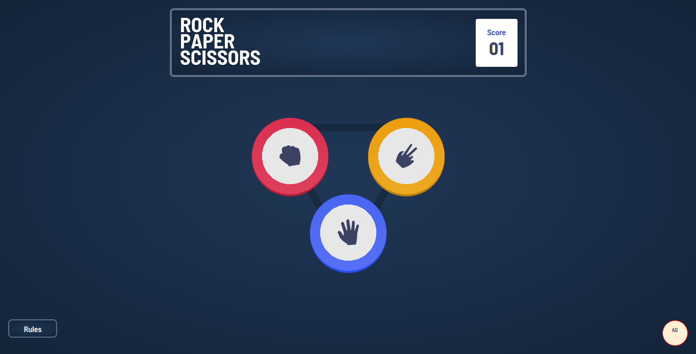

# Frontend Mentor - Rock, Paper, Scissors solution

This is a solution to the [Rock, Paper, Scissors challenge on Frontend Mentor](https://www.frontendmentor.io/challenges/rock-paper-scissors-game-pTgwgvgH). Frontend Mentor challenges help you improve your coding skills by building realistic projects. 

## Table of contents

- [Overview](#overview)
  - [The challenge](#the-challenge)
  - [Screenshot](#screenshot)
  - [Links](#links)
- [My process](#my-process)
  - [Built with](#built-with)
  - [What I learned](#what-i-learned)
  - [Continued development](#continued-development)
  - [Useful resources](#useful-resources)
- [Author](#author)
- [Acknowledgments](#acknowledgments)

**Note: Delete this note and update the table of contents based on what sections you keep.**

## Overview

### The challenge

Users should be able to:

- View the optimal layout for the game depending on their device's screen size
- Play Rock, Paper, Scissors against the computer
- Maintain the state of the score after refreshing the browser _(optional)_
<!-- - **Bonus**: Play Rock, Paper, Scissors, Lizard, Spock against the computer _(optional)_ -->

### Screenshot

### Links

- Solution URL: [https://github.com/andresgrdn/rock-paper-scissors-game](https://github.com/andresgrdn/rock-paper-scissors-game)
- Live Site URL: [https://andresgrdn.github.io/rock-paper-scissors-game/](https://andresgrdn.github.io/rock-paper-scissors-game/)

## My process

### Built with

- Semantic HTML5 markup
- CSS custom properties
- Flexbox
- CSS Grid
- Mobile-first workflow
- [React](https://reactjs.org/) - JS library
- [Next.js](https://nextjs.org/) - React framework
- [Styled Components](https://styled-components.com/) - For styles

**Note: These are just examples. Delete this note and replace the list above with your own choices**

### What I learned

Storage API

There is an api that allows the websites to storage some data into the user local storage, I used this api to save the game score even when the browser is closed. But I have a problem when the page loads the score was not being updated with the value saved. The solution that I used, was the document DOMcontentloaded event listener, into the callback I could update the score view with the score saved.

I have a better understanding about grid sizing

Reading the CSSWG grid draft I understand that when grid layout is used in every situation there are default sizes for the column and the rows.

### Continued development

Use this section to outline areas that you want to continue focusing on in future projects. These could be concepts you're still not completely comfortable with or techniques you found useful that you want to refine and perfect.

**Note: Delete this note and the content within this section and replace with your own plans for continued development.**

### Useful resources

- [Storage API | MDN docs site](https://developer.mozilla.org/en-US/docs/Web/API/Web_Storage_API/Using_the_Web_Storage_API) - This helped me to saved the score value and use it when the user visit again the game website. It is a tutorial from the MDN docs, It has some examples that help me to understand how to use the Storage API.
- [DOMContentLoaded | MDN docs site](https://developer.mozilla.org/en-US/docs/Web/API/Document/DOMContentLoaded_event) - This is the document event docs. It is good to learn how this event works. I used it for updating the score when the page is reload or first loaded.

## Author

- Website - [Andres Gordon](https://andresgrdn.github.io)
- Frontend Mentor - [@andresgrdn](https://www.frontendmentor.io/profile/andresgrdn)
- Twitter - [@andresgrdn](https://www.twitter.com/andresgrdn)